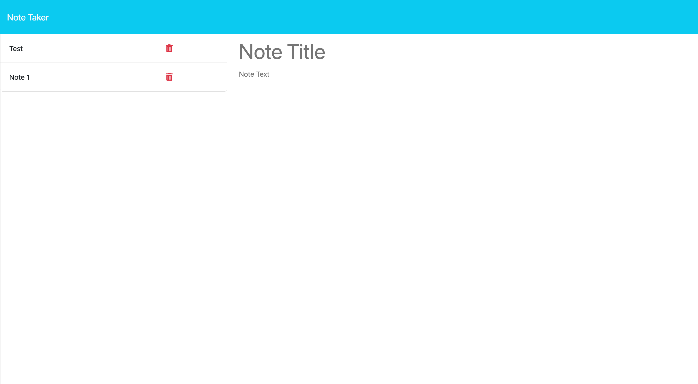

## Description

The Note Taker is a simple web application that allows users to create, store, and delete notes. It provides a convenient way to jot down quick thoughts, reminders, or ideas, and organize them for easy access later.
## Visuals

## Deployment

DEMO - [LIVE DEMO](https://note-taker-app-mv8m.onrender.com/)

## Usage

To use the webpage, you can review each section by clicking on the header links at the top of the page. To inspect each element, you can open the Chrome DevTools by pressing Command+Option+I (macOS) or Control+Shift+I (Windows). A console panel should open either below or to the side of the webpage in the browser. There you can navigate to the Accessibility tab to highlight each picture element,

## Credits

created express server, connected front and back end: vin galante

## License

MIT License.
